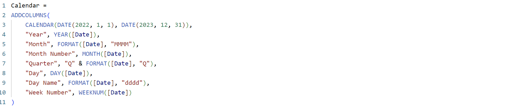

# Candy Market Share

 

## Introduction
The project focuses on analyzing candy and snack sales data from 2022 and 2023. It aims to identify top-performing products, trends in sales volume and revenue, popular brands, packaging types, and the most profitable distribution channels. The goal is to provide actionable insights through a clear and interactive dashboard to optimize sales strategies and marketing efforts.

This project is a part of the **FP20 Analytics Challenge 21**, where participants were tasked with analyzing the Candy Market Share for 2022 and 2023. The objective was to provide actionable business insights through comprehensive data analysis and visualization.

## Problem Statement
The candy industry is highly competitive, with multiple brands, manufacturers, and distribution channels vying for market dominance. The challenge aimed to answer critical business questions such as:
1. What are the top 10 candy items by sales volume in terms of weight in 2022 and 2023?

2. What are the top 10 candy items by sales volume regarding money value in 2022 and 2023?

3. What is the candies’ sales volume in terms of weight trend by month from 2022 to 2023?

4. What manufacturer had the most sales volume in the euro dollar in 2022?

5. What manufacturer had the fewest sales volume in weight in 2023?

6. Which package type of candy is the most popular to sell by weight?

7. Which candy category is the most popular to sell by revenue?

8. Which candy brand sold the most chips in 2022?

9. Which candy brand sold the most chocolate-related candies in 2023?

10. What is the most profitable distribution channel to sell candies?

## Skills Demonstrated
- **Data Analytics**: Extracting, transforming, and analyzing large datasets.
- **Data Visualization**: Creating an interactive dashboard to communicate insights.
- **Critical Thinking**: Translating business questions into actionable insights.
- **Dashboard Design**: Leveraging tools like ZoomCharts for effective storytelling.

## Data Sourcing
The dataset used in this project is provided as part of the **FP20 Analytics Challenge 21**. The data used for this analysis includes:
- Sales records for 2022 and 2023.
- Metrics such as sales volume (kg), revenue (euro), product categories, and package types.
- Manufacturer and distribution channel information.

More Information About This Challenge: [FP20 Analytics Challenge 21](https://zoomcharts.com/en/microsoft-power-bi-custom-visuals/challenges/fp20-analytics-november-2024)

## Data Transformation
To ensure accurate analysis, the following transformations were applied:
- Cleaned and structured the dataset for accurate analysis.
- Created a `Date` table to enable time intelligence features such as month-over-month and year-over-year analysis.
   
- Ensured data consistency and accuracy through normalization and data type adjustments.

## Modeling
The analysis used a descriptive analytics approach, focusing on summarizing historical data to identify trends and patterns. Key metrics calculated included:
- Developed relationships between datasets to enable multi-dimensional analysis.
   
- Created DAX measures to calculate key metrics such as:
  - Total Sales
     
  - Sales Volume
     
  - Month-over-month (MoM) changes
    - Sales
      
      
    - Sales Volume
     
  - Monthly trends and averages
    
    
     
- Implemented advanced DAX calculations for time-based KPIs and aggregate metrics.
  - Top Sales Category
    
  - Top Sales Item
    
  - Top Product Sales Volume KG
    
  - Top Volume Package Volume KG
    

## Analyze & Visualization
An interactive dashboard was developed to present the findings visually. The dashboard includes:
- **Sales and Volume Trends**: A monthly breakdown of sales for 2022 and 2023.
- **Top Items and Categories**: Rankings based on revenue and weight.
- **Manufacturer Performance**: Revenue and volume comparisons across manufacturers.
- **Distribution Channel Analysis**: Contributions to overall sales.

In this project there are 2 pages :
- Overview
- Detailed

You can interact with report here [FP20 Analytics Challenge 21](https://zoomcharts.com/en/microsoft-power-bi-custom-visuals/challenges/submission/a39dba3973a45216fae67632c82246b5?challenge=fp20-analytics-november-2024)

 

## Conclusion
The analysis provided several key insights:

- Crusty Cheddar consistently dominates sales volume by weight in both years. Other top items include Fine Slices Sour Cream and Spring Onions, Chips Blue Cheese, Crusty Chili, and Vanilla Wafers.
- Chips and Snacks generate the most revenue, significantly outpacing other categories. Top items are Classic Tzatziki and Crusty Chili.
- December shows a clear spike in sales across both years, likely driven by holiday demand.
- 'Others' Manufacturer dominates in revenue and sales volume, followed by Royal Blend Group.
- Bags are the most popular package type by weight.
- Land Corp leads in sales for chips, while Silver Snacks and Cascade Confectionery top chocolate-related candies.
- Small and Specialty Stores account for the highest sales volume and revenue, contributing 78.86% of the total.

## Achievements
- 🥇 **Top 5 Finalists** in the FP20 Analytics Zoomchart Challenge 21.

| Top 5 Finalists | 
|----------|
| 

Winner Announcement [Zoomchart](https://www.linkedin.com/posts/zoomcharts_zoomcharts-fp20analytics-powerbi-activity-7273026316000460800-V1OA?utm_source=share&utm_medium=member_desktop)

